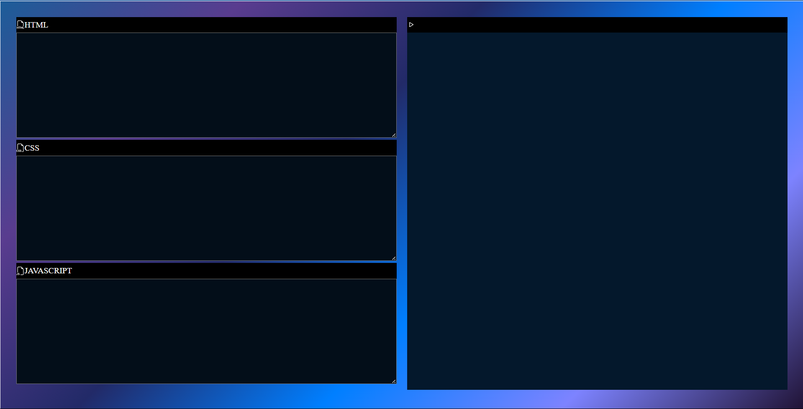

---

# Web-Based Code Editor

A simple web-based code editor that allows users to write and run HTML, CSS, and JavaScript code in real-time. The editor features a split-screen interface with dedicated sections for each language and a live preview of the output.

## Features

- **HTML, CSS, and JavaScript Support:** Write and edit code in separate text areas for HTML, CSS, and JavaScript.
- **Live Preview:** See the results of your code instantly in an embedded iframe.
- **Material Design Icons:** Use Material Symbols for HTML, CSS, and JavaScript file types.
- **Responsive Design:** Adjusts to different screen sizes for improved usability.

## Live Demo

You can try out the live version of the code editor here: [Live Demo]([https://example.co](https://himanshutamoli24.github.io/code-editor/)m) 

## Screenshots

 

## Installation

To run the code editor locally, follow these steps:

1. **Clone the Repository**

   ```bash
   git clone https://github.com/yourusername/web-based-code-editor.git
   ```

2. **Navigate to the Project Directory**

   ```bash
   cd web-based-code-editor
   ```

3. **Open `index.html` in Your Browser**

   You can open the `index.html` file directly from your file explorer or use a local server to view the application.

   **Using a local server:**

   ```bash
   npx http-server
   ```

## Usage

1. **Write Your Code:** 
   - Enter HTML code in the HTML text area.
   - Enter CSS code in the CSS text area.
   - Enter JavaScript code in the JavaScript text area.

2. **View Output:**
   - The result of the HTML, CSS, and JavaScript code will be displayed in the iframe on the right side of the editor.

3. **Save Your Work:**
   - As this is a basic editor, saving your work needs to be done manually. You can copy your code from the text areas and save it in your preferred code editor.

## Code Explanation

### HTML Structure

- **Text Areas:** Three text areas for HTML, CSS, and JavaScript code.
- **Iframe:** Displays the live preview of the code.

### CSS Styling

- **Gradient Background:** A visually appealing gradient background is used for the body.
- **Flexbox Layout:** The container uses Flexbox to create a responsive layout with left and right sections.
- **Dark Mode Theme:** A dark color scheme is used for the text areas and iframe for better readability.

### JavaScript Functionality

- **`run` Function:** 
  - Fetches code from the text areas.
  - Updates the iframe with HTML and CSS content.
  - Evaluates JavaScript code inside the iframe.
  - Ensures that the text color in the iframe is white for better visibility.

```javascript
function run() {
  let Hcode = document.getElementById("html").value;
  let Ccode = document.getElementById("css").value;
  let Jcode = document.getElementById("javascript").value;
  let output = document.getElementById("output");

  output.contentDocument.body.innerHTML = Hcode + "<style>" + Ccode + "</style>";
  output.contentWindow.eval(Jcode);
  output.contentDocument.body.style.color = "#fff";
}
```

## Contributing

Feel free to submit issues or pull requests if you have suggestions or improvements for the code editor.

## License

This project is licensed under the MIT License. See the [LICENSE](LICENSE) file for details.

## Acknowledgments

- [Material Symbols](https://fonts.google.com/icons) for icons used in the editor.
- [HTML5, CSS3, JavaScript](https://developer.mozilla.org/en-US/) for building the core technologies.

## Contact

For any questions or feedback, you can reach me at [himanshutamoli2005@gmail.com](mailto:himanshutamoli2005@gmail.com).

---
